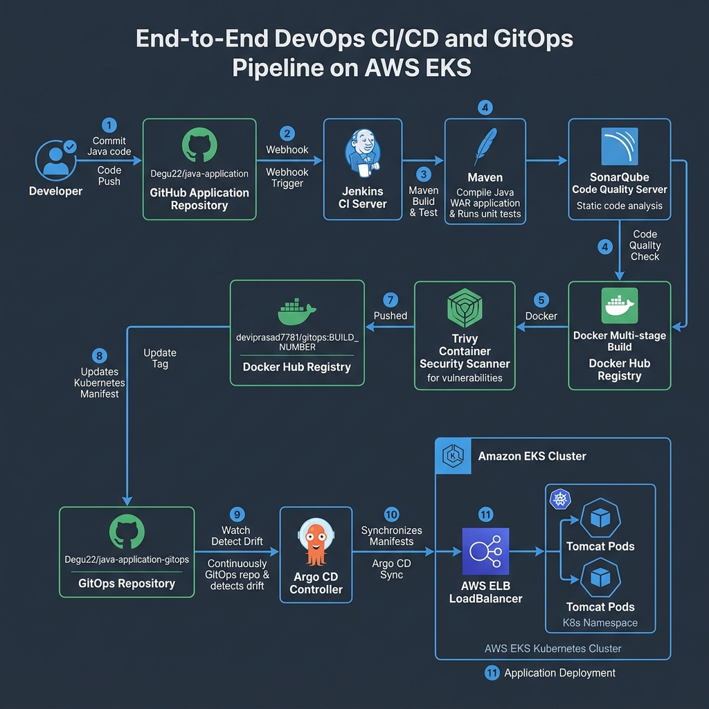
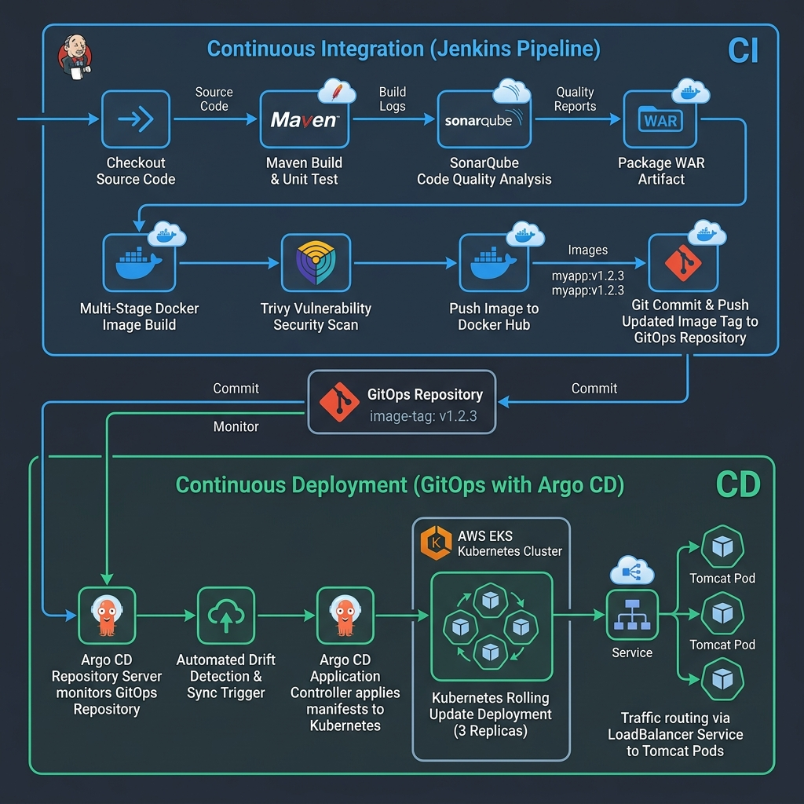
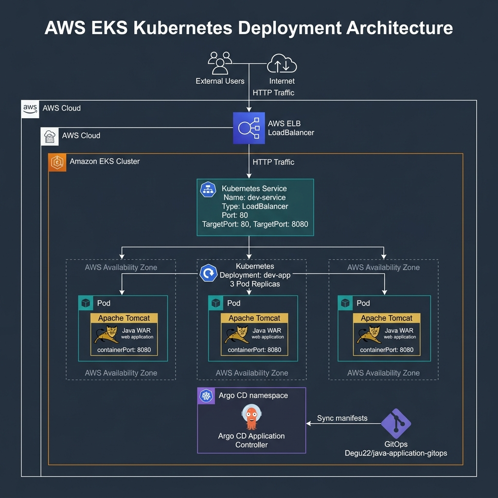

# Production-Style DevOps CI/CD and GitOps on AWS EKS


---

## 1. Project Title & Overview

**Production-Style DevOps CI/CD and GitOps Pipeline for Java Applications on Amazon EKS**

This project demonstrates a production-grade, enterprise-ready Continuous Integration (CI) and Continuous Deployment (CD) ecosystem utilizing GitOps principles. A Java web application packaged as a Web Application Archive (WAR) is automatically built, analyzed for code quality, security scanned, containerized, and deployed to an **Amazon Elastic Kubernetes Service (EKS)** cluster via **Argo CD**.

By maintaining a strict decoupling between Continuous Integration (Jenkins) and Continuous Deployment (Argo CD), this setup enforces single sources of truth, operational auditability, zero configuration drift, and rapid rollback capabilities.

---

## 2. Project Goals & Business Problems Addressed

### Engineering & Business Challenges Solved
* **Elimination of Manual Deployments**: Manual deployment steps lead to human error, inconsistent environments, and delayed release cycles. This pipeline automates every step from commit to Kubernetes rollout.
* **Separation of CI and CD Concerns**: Traditional pipelines grant CI engines direct cluster access, creating security risks and tight coupling. This project decouples CI (build/test/image creation) from CD (GitOps state synchronization).
* **Prevention of Configuration Drift**: Manual cluster edits (`kubectl edit`) cause drift between desired state and actual state. Argo CD continuously reconciles the cluster state against the Git repository.
* **Shift-Left Security & Quality**: Code defects and container vulnerabilities are caught early in the pipeline using SonarQube and Trivy before reaching production.
* **Traceable & Immutable Releases**: Every container build is tagged with a unique, immutable Jenkins build number, ensuring 100% traceability from running Kubernetes pods back to the exact Git commit.

---

## 3. Key Features

* **Automated Declarative Jenkins Pipeline**: End-to-end automation spanning code checkout, static code analysis, artifact compilation, Docker image creation, security scanning, and GitOps trigger.
* **SonarQube Code Quality Analysis**: Static security scanning, code coverage tracking, technical debt calculation, and quality gate enforcement.
* **Multi-Stage Containerization**: Optimized Docker builds utilizing multi-stage Dockerfiles to minimize final image size and reduce attack surface area.
* **Trivy Container Security Scanning**: Automated vulnerability scanning of container base images and application dependencies.
* **GitOps Continuous Delivery**: Argo CD automatically detects manifest changes in the GitOps repository and applies declarative state changes to AWS EKS.
* **High-Availability Kubernetes Deployment**: Multi-replica deployment with load balancing via AWS Elastic Load Balancer (ELB).

---

## 4. Technology Stack

| Technology | Domain | Purpose |
| :--- | :--- | :--- |
| **Java 11 / Maven** | Development | Application source code & build lifecycle management |
| **Apache Tomcat** | Application Server | Java WAR application runtime container |
| **Docker** | Containerization | Multi-stage image build & packaging |
| **Jenkins** | CI Automation | Pipeline orchestration & continuous integration |
| **SonarQube** | Code Quality | Static code analysis & code vulnerability checking |
| **Trivy** | Security | Container image vulnerability scanner |
| **Docker Hub** | Artifact Registry | Centralized container image storage (`deviprasad7781/gitops`) |
| **Git / GitHub** | Version Control | Source code repository and GitOps manifest repository |
| **AWS EKS** | Orchestration | Managed Kubernetes cluster on Amazon Web Services |
| **Argo CD** | Continuous Delivery | Declarative GitOps operator for Kubernetes |

---

## 5. End-to-End Architecture

The following diagram illustrates the complete flow of artifacts and control signals across the CI pipeline, image registry, GitOps repository, Argo CD, and AWS EKS cluster.



*Figure 1: Complete End-to-End DevOps CI/CD and GitOps Architecture on AWS EKS.*

### Architecture Flow Breakdown
1. **Developer Commit**: Code push to `Degu22/java-application` triggers the Jenkins Declarative Pipeline webhook.
2. **Jenkins CI Execution**:
   * **Stage 1 (Checkout)**: Clones application source code.
   * **Stage 2 (SonarQube Scan)**: Analyzes source code quality against SonarQube server rules.
   * **Stage 3 (Build Artifact)**: Runs Maven to compile Java code and generate `ROOT.war`.
   * **Stage 4 (Docker Build)**: Constructs a multi-stage Docker image tagged as `deviprasad7781/gitops:${BUILD_NUMBER}`.
   * **Stage 5 (Trivy Scan)**: Scans container image layers for CVE vulnerabilities.
   * **Stage 6 (Registry Push)**: Authenticates and publishes the image to Docker Hub.
   * **Stage 7 (GitOps Update)**: Clones separate GitOps repository (`Degu22/java-application-gitops`), updates `deploymentfiles/deployment.yml` with the new tag, and commits back to Git.
3. **Argo CD Synchronization**:
   * Argo CD continuously polls `Degu22/java-application-gitops`.
   * Detects the tag update in `deployment.yml` (OutOfSync state).
   * Executes a zero-downtime rolling update across Kubernetes Pods in AWS EKS.

---

## 6. CI/CD Workflow (Step by Step)

```text
[ Developer Commit ] 
        │
        ▼
[ Jenkins Webhook Trigger ]
        │
        ├─► 1. Checkout Source Code
        ├─► 2. SonarQube Code Quality Analysis
        ├─► 3. Maven Build & WAR Packaging (mvn clean package)
        ├─► 4. Docker Multi-Stage Image Build
        ├─► 5. Trivy Security Vulnerability Scan
        ├─► 6. Push Container Image to Docker Hub Registry
        └─► 7. Commit & Push Updated Image Tag to GitOps Repository
                                │
                                ▼
               [ Argo CD Pull & Drift Detection ]
                                │
                                ▼
               [ AWS EKS Deployment & Pod Rollout ]
```

---

## 7. GitOps Architecture & Argo CD Role

GitOps is an operational framework that uses Git repositories as the single source of truth for infrastructure and application code.



*Figure 2: Clear Boundary Separation between Continuous Integration (Jenkins) and Continuous Delivery (Argo CD).*

### Key Principles Implemented
* **Declarative System State**: Kubernetes manifests (`deployment.yml`, `service.yml`) define the exact desired state of the cluster.
* **Separation of Privileges**: Jenkins has access to Docker Hub and the GitOps GitHub repository, but **no direct access or credentials for AWS EKS**. This eliminates cluster takeover risks if CI is compromised.
* **Automated Reconcile Loop**: Argo CD runs inside the EKS cluster. It periodically compares the running cluster state against the main branch of `Degu22/java-application-gitops`.
* **Self-Healing & Anti-Drift**: If an engineer manually alters a pod or deployment in EKS via `kubectl`, Argo CD immediately flags the drift and overwrites the cluster state back to the Git source.

---

## 8. Repository Structure

```text
java-application/
├── .dockerignore                 # Excludes unneeded files from Docker context
├── .gitignore                    # Excludes Maven target and local IDE files
├── Dockerfile                    # Multi-stage Docker build specification
├── Jenkinsfile                   # Declarative Jenkins CI pipeline definition
├── jenkins                       # Synchronized Jenkins pipeline script
├── pom.xml                       # Maven project dependencies & plugins
├── README.md                     # Comprehensive project documentation
├── docs/
│   └── images/
│       ├── architecture.png       # End-to-End Architecture diagram
│       ├── cicd-gitops-flow.png   # CI vs GitOps workflow diagram
│       └── deployment-workflow.png# AWS EKS Kubernetes deployment layout
└── src/
    └── main/
        └── webapp/
            ├── index.jsp         # Web application homepage
            └── WEB-INF/
                └── web.xml       # Servlet configuration
```

---

## 9. Application Build & Local Execution Instructions

### Prerequisites
* Java JDK 11 or higher
* Apache Maven 3.8+

### Step 1: Clone Repository
```bash
git clone https://github.com/Degu22/java-application.git
cd java-application
```

### Step 2: Compile & Package Application
```bash
# Clean build directory and package application as WAR artifact
mvn clean package
```
*Output*: Generates target artifact at `target/java-application.war`.

### Step 3: Run Unit Tests
```bash
mvn test
```

---

## 10. Docker Image Build, Tagging & Execution

### Prerequisites
* Docker Engine 20.10+

### Local Docker Build
```bash
# Build multi-stage image locally
docker build -t deviprasad7781/gitops:local -f Dockerfile .
```

### Local Docker Run
```bash
# Execute Tomcat container mapping host port 8080 to container port 8080
docker run -d -p 8080:8080 --name java-app-test deviprasad7781/gitops:local
```

### Verify Container Endpoint
Access the local application in your browser at `http://localhost:8080`.

---

## 11. Jenkins Pipeline Stages & Responsibilities

The Jenkins Declarative Pipeline is defined in [Jenkinsfile](file:///c:/Users/devip/Desktop/AntiGravityMiniProj/ArgoCD/temp_java_app/Jenkinsfile).

```groovy
pipeline {
    agent any

    tools {
        maven 'maven'
    }

    environment {
        DOCKER_IMAGE = 'deviprasad7781/gitops'
        GITOPS_REPO  = 'https://github.com/Degu22/java-application-gitops.git'
    }

    stages {
        stage('Checkout') { ... }
        stage('SonarQube Scan') { ... }
        stage('Build Artifact') { ... }
        stage('Build Docker Image') { ... }
        stage('Scan Docker Image using Trivy') { ... }
        stage('Push to Docker Hub') { ... }
        stage('Update Deployment File') { ... }
    }
}
```

| Stage | Command / Tool | Action / Responsibility |
| :--- | :--- | :--- |
| **1. Checkout** | `git branch: 'main'` | Pulls application code from GitHub. |
| **2. SonarQube Scan** | `mvn sonar:sonar` | Performs static code quality and security scanning. |
| **3. Build Artifact** | `mvn clean package` | Compiles Java code and builds WAR binary. |
| **4. Build Docker Image** | `docker build` | Multi-stage image build tagged with `${BUILD_NUMBER}`. |
| **5. Trivy Scan** | `trivy image` | Inspects container filesystem layers for CVEs. |
| **6. Push to Registry** | `docker push` | Authenticates and uploads image to Docker Hub. |
| **7. GitOps Manifest Update**| `sed` & `git push` | Updates image tag in `deployment.yml` in GitOps repo. |

---

## 12. SonarQube Integration & Quality Gate

SonarQube analyzes the source code to identify bugs, vulnerabilities, security hotspots, and code smells.

```bash
mvn sonar:sonar \
  -Dsonar.host.url=http://<SONARQUBE_SERVER_IP>:9000 \
  -Dsonar.token=${SONAR_TOKEN}
```

### Key Metrics Monitored
* **Reliability**: Bugs and code defects.
* **Security**: OWASP top 10 vulnerabilities & security hotspots.
* **Maintainability**: Technical debt ratio and code smells.
* **Coverage**: Unit test statement coverage percentage.

---

## 13. Container Security Scanning (Trivy)

Aqua Security Trivy scans container images for system package and application dependency vulnerabilities before registry publishing.

```bash
trivy image deviprasad7781/gitops:${BUILD_NUMBER}
```

* **Target Scanned**: Base image layers (`tomcat:9.0-jre11-openjdk-slim`), Maven dependencies, Java libraries.
* **Policy**: Identifies `HIGH` and `CRITICAL` severity CVEs to prevent insecure container deployments.

---

## 14. Docker Hub Image Publishing

Images are published to the public Docker Hub registry under the account repository `deviprasad7781/gitops`.

```bash
# Login via non-interactive stdin credentials
echo "$DOCKERHUB_PASS" | docker login -u deviprasad7781 --password-stdin

# Push tagged release image
docker push deviprasad7781/gitops:${BUILD_NUMBER}
```

### Tagging Convention
* **Immutable Tag**: `deviprasad7781/gitops:${BUILD_NUMBER}` (e.g., `deviprasad7781/gitops:6`).
* Prevents image mutation and enables precise rollbacks.

---

## 15. Kubernetes Deployment & Service Configuration

The Kubernetes deployment architecture for Amazon EKS is shown below.



*Figure 3: AWS EKS Kubernetes Cluster Traffic Routing, Pod Replicas, and LoadBalancer Service.*

### Manifest Definitions (`Degu22/java-application-gitops`)

#### `deploymentfiles/deployment.yml`
```yaml
apiVersion: apps/v1
kind: Deployment
metadata: 
  name: dev-app
  labels:
    app: dev-deploy
spec:
  replicas: 3
  selector:
    matchLabels: 
      app: dev-deploy
  template:
    metadata:
      labels: 
        app: dev-deploy
    spec:
      containers:
        - name: dev-container
          image: deviprasad7781/gitops:6
          ports: 
            - containerPort: 8080
```

#### `deploymentfiles/service.yml`
```yaml
apiVersion: v1
kind: Service
metadata:
  name: dev-service
  labels:
    app: dev-deploy
spec: 
  type: LoadBalancer
  selector:
    app: dev-deploy
  ports:
    - protocol: TCP
      port: 80
      targetPort: 8080
```

---

## 16. AWS EKS and Argo CD Setup Instructions

### Step 1: Create Amazon EKS Cluster using `eksctl`
```bash
eksctl create cluster \
  --name production-eks-cluster \
  --region us-east-1 \
  --nodegroup-name standard-workers \
  --node-type t3.medium \
  --nodes 3 \
  --nodes-min 2 \
  --nodes-max 4 \
  --managed
```

### Step 2: Install Argo CD on EKS
```bash
# Create Argo CD namespace
kubectl create namespace argocd

# Install Argo CD components
kubectl apply -n argocd -f https://raw.githubusercontent.com/argoproj/argo-cd/stable/manifests/install.yaml

# Expose Argo CD Server UI via LoadBalancer
kubectl patch svc argocd-server -n argocd -p '{"spec": {"type": "LoadBalancer"}}'
```

### Step 3: Create Argo CD Application CRD
```yaml
apiVersion: argoproj.io/v1alpha1
kind: Application
metadata:
  name: java-application-gitops
  namespace: argocd
spec:
  project: default
  source:
    repoURL: 'https://github.com/Degu22/java-application-gitops.git'
    targetRevision: HEAD
    path: deploymentfiles
  destination:
    server: 'https://kubernetes.default.svc'
    namespace: default
  syncPolicy:
    automated:
      prune: true
      selfHeal: true
```
Save as `argocd-app.yaml` and execute:
```bash
kubectl apply -f argocd-app.yaml
```

---

## 17. Jenkins Credentials & Secret Management Practices

To ensure secure execution without embedding sensitive tokens in source repositories:

1. **Docker Hub Access**: Stored in Jenkins as a Secret Text credential (`dockerhub-pass`). Used via `withCredentials([string(...)])`.
2. **GitHub Personal Access Token**: Stored in Jenkins as a Secret Text credential (`github`). Allows automated updates to `Degu22/java-application-gitops`.
3. **SonarQube Token**: Stored in Jenkins as a Secret Text credential (`sonar-token`).
4. **No Cluster Credentials in Jenkins**: Jenkins does not require `kubeconfig` or AWS IAM keys for deployment, eliminating cross-domain credential leakage.

---

## 18. Troubleshooting & Common Errors

### 1. TargetPort Mismatch (HTTP 502 Bad Gateway / Connection Refused)
* **Symptom**: LoadBalancer responds with 502 or times out.
* **Root Cause**: Tomcat listens on `containerPort: 8080`, but Service `targetPort` was set to `80`.
* **Fix**: Ensure `service.yml` specifies `targetPort: 8080`.

### 2. Git Push Authorization Failed in Jenkins
* **Symptom**: `fatal: Authentication failed for ... java-application-gitops.git`.
* **Root Cause**: Expired or missing GitHub Personal Access Token (PAT) in Jenkins Credentials.
* **Fix**: Generate GitHub PAT with `repo` permissions and update Jenkins credential ID `github`.

### 3. Argo CD Application OutOfSync / Degraded State
* **Symptom**: Argo CD UI shows application status as `OutOfSync`.
* **Root Cause**: Manual changes made to cluster resources directly via `kubectl`.
* **Fix**: Enable `automated.selfHeal: true` in Argo CD Application manifest or trigger manual sync.

---

## 19. Security Considerations & AWS Cleanup

### Security Best Practices
* **Non-Root Execution**: Container runtimes run Tomcat under dedicated unprivileged users.
* **Multi-Stage Build**: Excludes Maven source code and compiler tooling from final runtime image.
* **Zero Secret Exposure**: Public repositories contain zero environment keys, database passwords, or cloud credentials.

### AWS Resource Cleanup Commands
To avoid incurring unnecessary AWS cloud charges after completing testing:

```bash
# Delete Argo CD Application and Kubernetes resources
kubectl delete -f argocd-app.yaml

# Delete AWS EKS cluster and provisioned Elastic Load Balancers
eksctl delete cluster --name production-eks-cluster --region us-east-1
```

---

## 20. Future Improvements

* **Helm Chart Packaging**: Convert raw Kubernetes manifests into dynamic Helm Charts with environment-specific `values.yaml` files.
* **Monitoring & Observability**: Integrate Prometheus and Grafana dashboards for cluster resource and Tomcat JVM monitoring.
* **Progressive Delivery**: Implement Argo Rollouts for Canary and Blue-Green deployment strategies.
* **Vault Integration**: Dynamically inject runtime application secrets using HashiCorp Vault operator.

---

## 21. Project Repository & Resource Links

* 📦 **Application Repository**: [Degu22/java-application](https://github.com/Degu22/java-application)
* 🚀 **End-to-End DevOps Repository**: [Degu22/ArgoCD-End-to-End](https://github.com/Degu22/ArgoCD-End-to-End)
* ⚙️ **GitOps Manifests Repository**: [Degu22/java-application-gitops](https://github.com/Degu22/java-application-gitops)
* 🐳 **Docker Hub Container Registry**: [deviprasad7781/gitops](https://hub.docker.com/r/deviprasad7781/gitops)